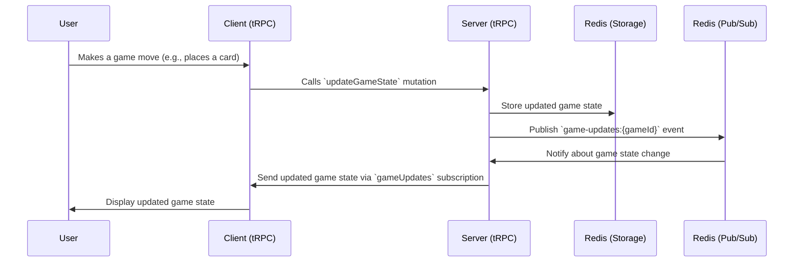

```mermaid
sequenceDiagram
    participant User
    participant Client (tRPC)
    participant Server (tRPC)
    participant Redis (Storage)
    participant Redis (Pub/Sub)

    User->>Client (tRPC): Makes a game move (e.g., places a card)
    Client (tRPC)->>Server (tRPC): Calls `updateGameState` mutation
    Server (tRPC)->>Redis (Storage): Store updated game state
    Server (tRPC)->>Redis (Pub/Sub): Publish `game-updates:{gameId}` event
    
    Redis (Pub/Sub)->>Server (tRPC): Notify about game state change
    Server (tRPC)->>Client (tRPC): Send updated game state via `gameUpdates` subscription
    Client (tRPC)->>User: Display updated game state
```